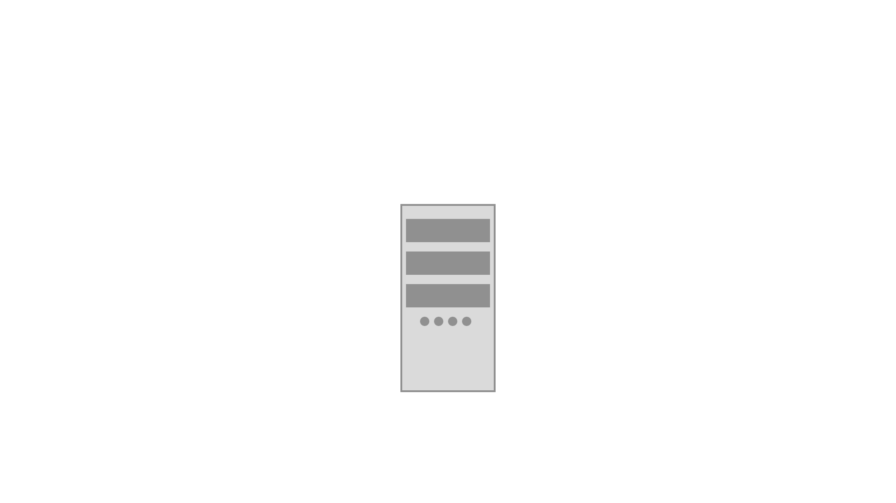
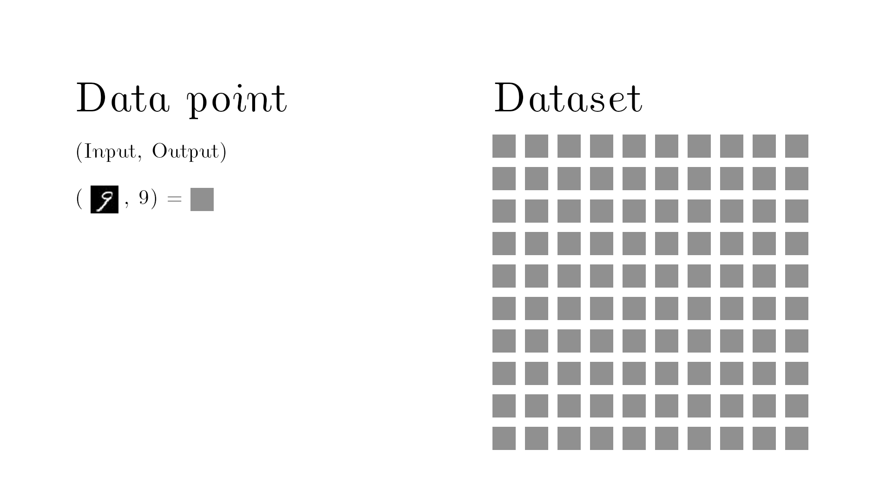
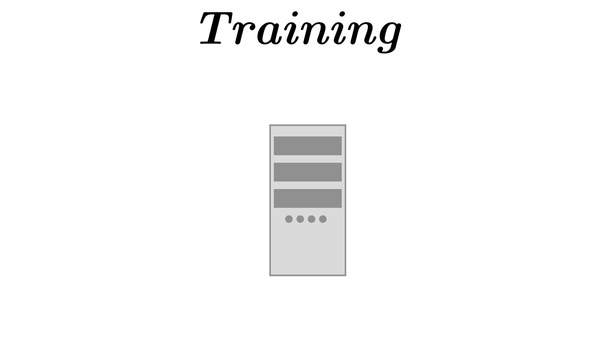
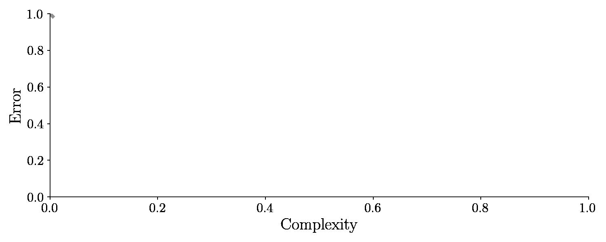
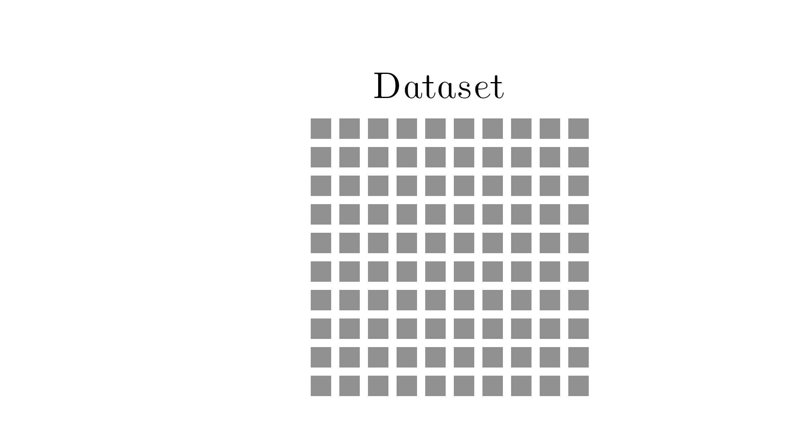

# The Bias-Variance tradeoff - why being too smart is dumb.
So maybe the title is a little clickbaity, I'm sorry - but the concept is important if you ever want to do something useful in machine learning.

## Supervised learning
Right so I said it was important in machine learning, so let's just discuss machine learning for one second before moving on with the bias versus variance trade-off.

When doing supervised learning the idea is to learn to take some input, and predict the correct output.

One example of this task is to take a handwritten image of a number and then get the machine to recognize what number it is.

You must prepare sufficient data examples for the computer to learn. One data point (represented below with a gray cube) is the input and the output. The dataset must contains multiple examples of this, for a good machine learning model.

So you're giving the computer the thing to learn and the answer.

You then train the model by continuously feeding the machine learning these data points and just keep on tweaking the parameters in the machine learning model until it can correctly take an image and classify it correctly.

This is kind of like a teacher to student scenario where the teacher is providing examples and the corresponding correct answer.

After we are done tweaking the machine, we take the data points and measure how good it is. In other words, we measure how often the model correctly classify an image - it turns out, if you have given enough data examples and the model is sufficiently complex the error will go to absolutely zero.

This mean, the model will never classify an image wrong! This seems all well and good, right?  The error is zero, so we should be done, right? .. Well no .. It's not good actually, we have used the same training examples for training and testing and that's kind of like student going to an exam where the students are already seen the question and the answers.

So the machine learning model could have just remembered the answers and not learned anything at all.

Therefore, we must go back, and the take the data set and then we split it up.

We only use one set the "training set" for training the algorithm and then we use the other set for testing it, the so-called "test-set" - it should be called an exam set!

This test-set we will check how well it performs once we are done training the model. So this error on the unseen test-set is the golden measurement for checking our machine learning model. And it turns, if we adjust the complexity this time, the error on the test set will suddenly increase again after dropping. It looks like this:

You can see there exists some optimal balance between model complexity and low error on the test set. It turns out model complexity is related to bias and variance. We will see that soon too! It is related to the bias and variance.

## Bias and variance decomposition
The error can be decomposed into three things the bias the variance and the noise.

$$ \text{Error} = \text{Bias}(\hat{y})^2 + \text{Var}(\hat{y}) + \text{Noise}$$

But we can't get rid of the noise so let's ignore that why can you decompose the error into bias and variance let me give you an example

Let's make an algorithm which goal is just to learn to output the number 10 yeah right so that's really really easy. The number 10 is called the target function. So that's called y.

Now comes in one try of estimating y and that's called of course called y hat. So that's our estimate of the target function.  And it turns out this current estimate is that it is always kind of off the target and that's called the bias it is the true value minus the expectation value and it measures how often we are consistently wrong right so that was one bad estimation of hitting the number 10.

Now comes in another approximation and this approximations guesses is spread everywhere around the target and this is of course the variance! this is the equation for the variance it doesn't take into account the actual answer it just measures how spread out the data points are relative to each other.

So that was the two examples where one exam was really biased and one example was highly variant and so an actual attempt would consist of both errors so there will be some spread in the position and there will be some bias.

When you make a machine learning model you must try to balance how much bias you have and how much variance you have and somewhere in between there is an optimal balance.

Blue is the bias and purple is the variance. Adjusting each other leads to an optimal balance and up to the lowest error but up until now i haven't shown you what model complexity is and how it relates to bias and variance let's do that with yet another example.

## Complexity trade-off

Okay here is an example that we could be trying to learn with machine learning say that this is an absolutely true function for hours in the sun and the corresponding cell damage on the skin.

Off course this is a dream scenario to know a true function like this - in reality we never know this relation, this black line here. Let's pretend it is a second degree polynomial with these values.

Let's use machine learning to learn/estimate this function. We team up with a doctor that measures some patients and get these data points. The data points can be exactly on the true line because of noise and randomness. But at least we got some data points.

So this is our data set as I said earlier we'll split the data set into a training set and a test set.

So now I'll try to fit this with two different polynomials first a zero degree polynomial - so just a number.

And then a 5th degree polynomial.

Now it's time to measure how good we performed so we'll measure the error of the test set so that's the average distance to the test points.

It turns out the 0th degree polynomial is highly highly biased and this means that this machine learning model has underfit it was not able to capture the patterns in the data.

And the fifth degree polynomial was highly highly variant it fitted too well on the noise the data, therefore the prediction are highly spread. The model is over-fit.

We must control the bias and the variance in order to make a good machine learning model. Therefore we will now we will try to vary the degree of the polynomial in order to vary the bias and the variance. In other words, we model the complexity of the model; the higher degree polynomials we have the more learnable parameters we have.

So above I'm showing you the bias and the variance and the total error given by this equation turns out we have found an optimal value for the bias and variance right here that's the lowest error of the test set it wasn't able to find the correct second degree polynomial but we also had a very small data-set.

Overfit means you have a low error on the training set but a high error on the test set.
Underfit means you have a high error on the training set and a high error on the test set as well

## Weird example
It sounds so weird we'll need to control or maybe even introduce some bias or some variance in order to get a low generalization error.

If the model is not sophisticated enough it doesn't have high enough complexity / enough learnable parameters

If the model is too clever too complex it has too many learnable parameters it's going to see all the noise in the data set and it will find the wrong patterns.

Somewhere in between there is some good balance between being too dumb and too smart.

Making a model dumber is called regularization and i showed you that by reducing the polynomial degrees in a polynomial fit.

When using regularization in a neural network it's called dropout or optimizing via brain damage so we just simply remove connections between neurons to make it dumber.

You can also regularize a decision tree by pruning.

There you have it a mathematical relationship showing you why it is a good idea to find a balance between underthinking and overthinking! And now you can make a better machine learning model.

Help me produce more science content by becoming my patreon or explore my science gifs that are aviable as NFT's. Thank you!
