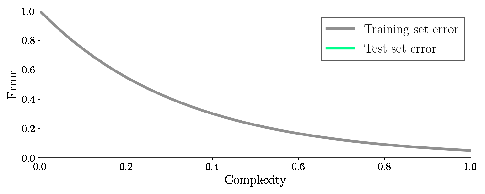
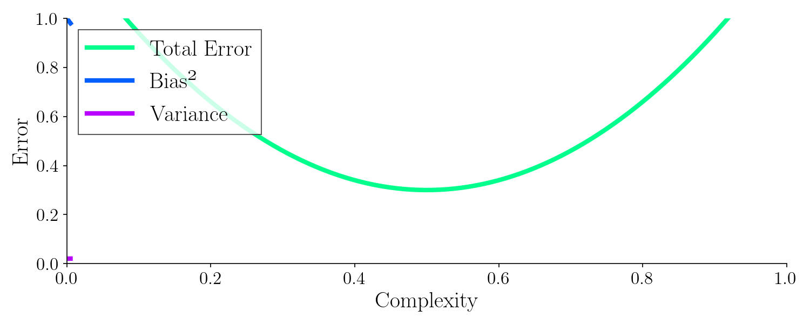

# The Bias-Variance Tradeoff - Why Being Too Smart is Dumb
So maybe the title is a little clickbaity, I'm sorry, but the concept is important if you ever want to do something useful in machine learning.

## Supervised learning
To understand the bias-variance tradeoff, let's discuss supervised machine learning for one second before moving on.

When doing supervised learning, the idea is to learn to receive input and predict the correct output.

One example of this task is to take an image of a handwritten number and then get the machine to recognize what number it is.

For the computer to learn, you must provide sufficient data examples. One data point is an input and its corresponding output. This is represented below with a gray cube.

The dataset must contains multiple data points, to achieve a good machine learning model.

You then train the model by continuously feeding the machine these data points and continue tweaking the parameters of the machine learning model to learn from the given examples.

This is kind of like a teacher-to-student scenario where the teacher provides questions and the corresponding correct answer.

After we are done tweaking the model, we take the data points and measure the performance of the model. In other words, we count how often the model correctly classifies an image. It turns out, if you have provided enough data examples and the model is sufficiently complex, the error will go to zero.

An error of zero seems all well and good, right?  The error is zero, so we should be done, right? .. Well no .. It's not good actually because now we have used the same training examples for training and testing. That's kind of like a student going to an exam with questions the teacher has already answered.

So the machine learning model could have just memorized the answers and not learned anything at all.

Therefore, we must go back and split up the dataset into a training set and a test set.

We only use one set, the *training set*, for training the algorithm and the other set for testing, the so-called *test set*. Now we have an appropriate data set for the model - data it has never seen before!

With the test set, we will check how well the model performs once we are done training. So the error on the unseen test set is the golden measurement for checking our machine learning model. And it turns out if we adjust the complexity this time, the error on the test set (green line) will suddenly increase again after dropping. It looks like this:
<!-- TODO overvej legend -->

As seen from the graph, an optimal balance between model complexity and low error on the test set exists. It turns out, model complexity is related to bias and variance. We will see that soon too!

## Bias and Variance Decomposition
The error can be decomposed into three things; the bias, the variance, and the noise.

$$ \text{Error} = \text{Bias}(\hat{y})^2 + \text{Var}(\hat{y}) + \text{Noise}$$

But we can't get rid of the noise so let's ignore that. Let's see why you can decompose the error into bias and variance.

In the following example, a machine learning model is trying to learn to output the number 10. Yeah right, so that's really easy. In this example, the number 10 is called the target function $y$. When a machine learning model tries to estimate $y$, the estimate is called $ \hat{y} $.

Now comes in a machine learning model, trying to guess/hit the number 10. It turns out this current model is always systematically of off the target.

Being systematically of target is called the bias and is given by: $\operatorname{Bias}(\hat{y})=y-E[\hat{y}]$. It is the true value minus the expectation value and it measures how often we are consistently wrong right so that was one bad estimation of hitting the number 10.

Now comes in another machine learning model and its guesses is spread everywhere around the target!

Spread is off course a measure of varaince. Variance is given by: $
\operatorname{Var}(\hat{y})=E\left[(E[\hat{y}]-\hat{y})^{2}\right]
$. The equation doesn't take into account the actual answer it just measures how spread out the data points are relative to each other.

So that was the two examples where one exam was really biased and one example was highly variant. An actual machine learnig models gueeses would consist of both bias and variance:

When you make a machine learning model you must try to balance how much bias you have and how much variance you have in the error. Somewhere in between there is an optimal balance.

Blue is the bias and purple is the variance. Adjusting each other leads to an optimal balance and up to the lowest error.

But up until now i haven't shown you what model complexity is and how it relates to bias and variance let's do that with yet another example.

## Complexity trade-off

To show you the complexity trade-off with an example, imagine that we are  trying to learn hours in the sun and the corresponding cell damage on the skin with machine learning. Imagine below the true function we would like to find looks like this:

Off course this is a dream scenario to know a true function we are trying to find - in reality we never know this. Let's pretend it is a second degree polynomial with these values.

$$ f(x) = 0.2 x^2 + 1.5x + 1$$

Where $f(x)$ is cell damage and $x$ is hours in the sun. Let's use machine learning to learn/estimate this function. We team up with a doctor that measures some patients and get these data points.

The data points can be exactly on the true line because of noise and randomness. But at least we got some data points.

So this is our data set as I said earlier we'll split the data set into a training set and a test set.

So now I'll try to fit this with two different polynomials first a zero degree polynomial $f(x) = a_0$ so just a number. Let's mark the fit with blue. I'll also fit a  5th degree polynomial $f(x) =  a_5 x^5 + a_4 x^4 + a_3 x^3 + a_2 x^2 + a_1 x + a_0$ marked as purple. This is the result.

Let's have a look on the bias and variance of these different fits, with respect of the test set (green points).

It turns out the 0th degree polynomial is highly highly biased. and this means that this machine learning model has underfit it was not able to capture the patterns in the data. And the fifth degree polynomial was highly highly variant it fitted too well on the noise the data, therefore the prediction are highly spread. The model is over-fit.

So somewhere between a 0 degree fit, and a 5'fth degree fit mut be a better function to generalize. Below i will interpolate from 0 to 5 degree polynomial and fit:

Let's see the Variance, Bias and total error for all these fits:

It turns out the best model to generalize was with a complexity around 0.5. You can see where Bias and variance meet, the total error is lowest. The model did not find the true function, $ f(x) = 0.2 x^2 + 1.5x + 1$, but our test and train sample is also very low.

You can see we must control the bias and the variance in order to make a good machine learning model, which corresponds to adjusting the complexity of a model. Adjust the complexity also adjusts the models tendency to overfit vs underfit. Overfit means you have a low error on the training set but a high error on the test set. Underfit means you have a high error on the training set and a high error on the test set as well.

# Other examples

It sounds weird we'll need to control or maybe even introduce some bias or some variance in order to get a low generalization error.

If the model is not sophisticated enough it doesn't have high enough complexity / enough learnable parameters, and the model will underfit.

If the model is too clever too complex it has too many learnable parameters it's going to see all the noise in the data set and it will find the wrong patterns, i.e overfit.

Somewhere in between overfit and underfit here is some good balance between being too dumb and too smart.

Making a model dumber is called regularization and i showed you that by reducing the polynomial degrees in a polynomial fit.

When using regularization in a neural network it's called dropout or optimizing via brain damage where we just simply remove connections between neurons to make it dumber.

You can also regularize a decision tree by pruning the connections.

There you have it a mathematical relationship showing you why it is a good idea to find a balance between under-thinking and overthinking! And now you can make a better machine learning model.

Help me produce more science content by becoming my patreon or explore my science gifs that are aviable as NFT's. Thank you!
